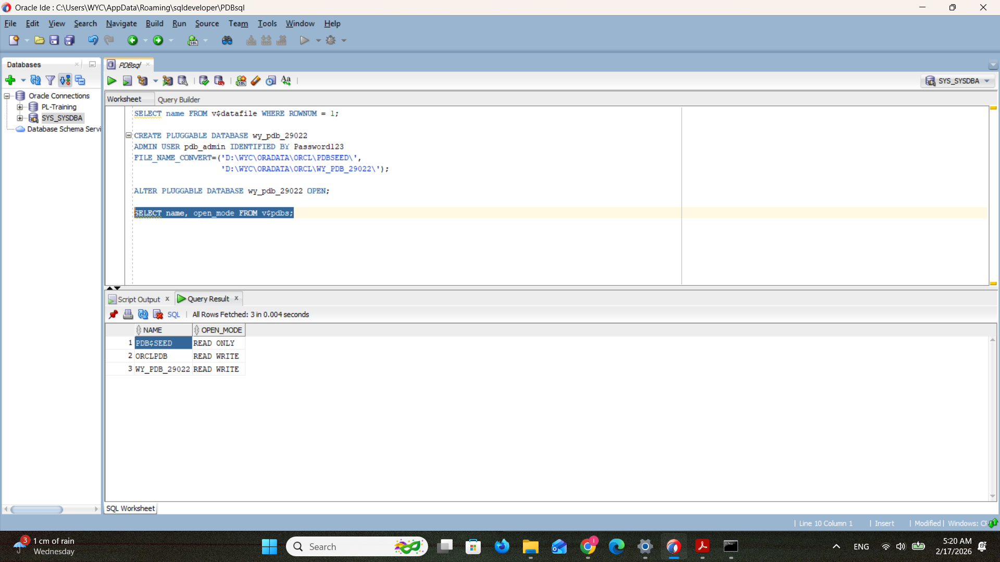
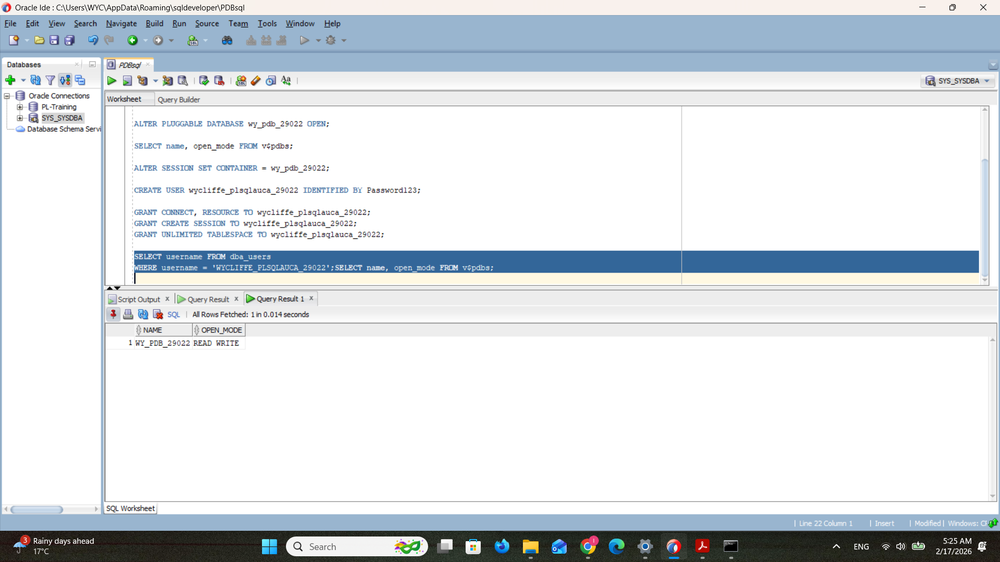
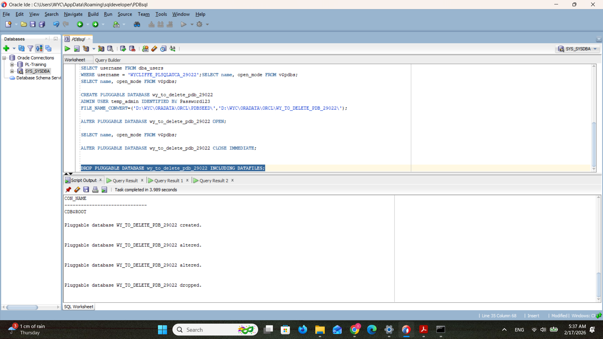
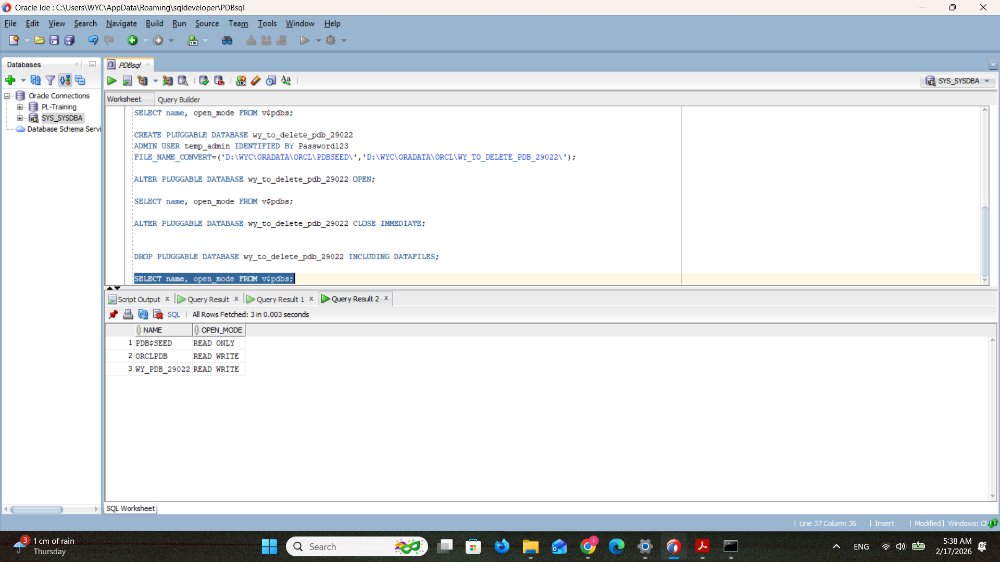
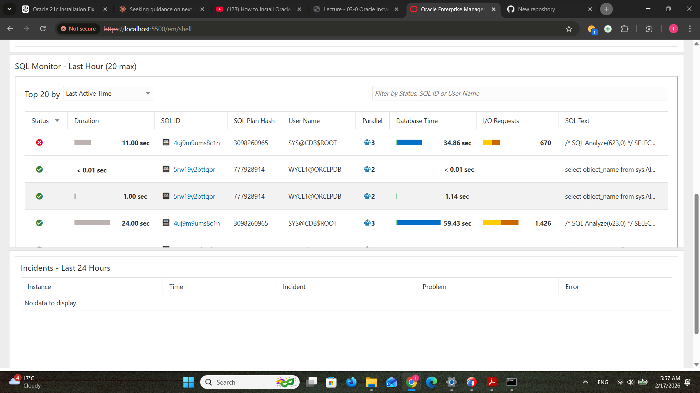

# oracle_pdb_ass_II_29022_-wycliffe-
Creating and interacting with PDBs and using OEM

# Oracle PDB Assignment II
-**Names:** ISHIMWE Wycliffe
-**ID**: 29022
-**Group:** D
-**Course:** Database Development with PL/SQL (INSY 8311)  
-**Assignment Date:** February 9, 2026  

## Oracle Environment
- Oracle Version: 11.0.0
- CDB Name: ORCL
- Host: localhost
- Port: 1521

## Task 1: Main PDB Creation
- **PDB Name:** wy_pdb_29022
- **Username:** wycliffe_plsqlauca_29022
- **Status:** Successfully created and opened

### Screenshots:



## Task 2: Temporary PDB Creation and Deletion
- **Temporary PDB Name:** wy_to_delete_pdb_29022
- Successfully created, verified, and deleted

### Screenshots:



## Task 3: Oracle Enterprise Manager (OEM)
- OEM accessed via https://localhost:5500/em
- Dashboard showing all PDBs successfully

### Screenshots:



## Challenges Faced
- Initially encountered ORA-12514 error (service not registered)
- Resolved by opening the ORCLPDB pluggable database
- Encountered ORA-65040 error when creating PDB from wrong container
- Resolved by switching back to CDB$ROOT first

## Integrity Statement
I declare that this assignment was completed individually 
and represents my own work without unauthorized assistance.
```

---
